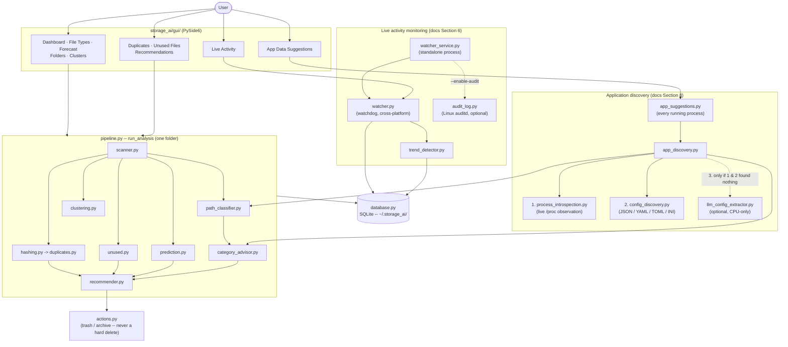
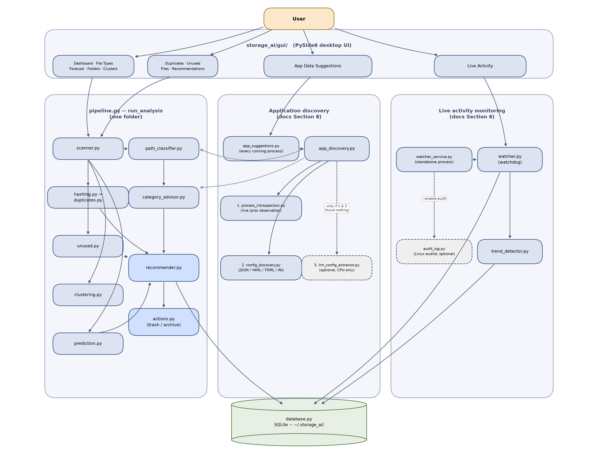
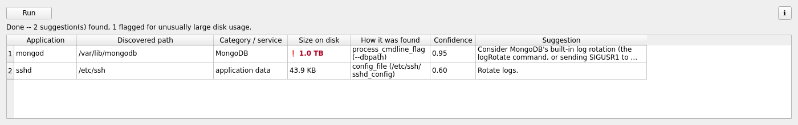

# Storage AI — Intelligent Storage Cleanup Assistant

A desktop application that scans a folder tree, finds duplicate and likely-unused
files, forecasts future storage growth, and turns all of that into ranked,
actionable cleanup/archiving recommendations.

Built as an academic project on **AI at the Application Level**: rather than
call out to an LLM, the "AI" here is a set of classical, explainable
techniques — content hashing, weakly-supervised classification, and linear
regression forecasting — chosen so every recommendation can be traced back to
a concrete reason. See [`docs/METHODOLOGY.md`](docs/METHODOLOGY.md) for the
full write-up, and [`future_plan.md`](future_plan.md) for scalability and
local-LLM ideas not yet built.

## Novelty

None of the individual algorithms here are new — hashing, a random-forest
classifier, K-means, linear regression, and extractive QA are all
textbook techniques. What's actually novel is how they're composed:

- **Reliability-ordered discovery, not table-first or model-first.**
  Finding an unknown application's storage path tries the cheapest, most
  certain signal first (live process introspection via `/proc`), then a
  declared config setting, and only reaches an optional local LLM for the
  narrow remainder that doesn't parse as anything structured — the
  opposite of the common "LLM by default, rules as a fallback" pattern.
- **A deterministic gate around every non-deterministic component,
  applied consistently, not once.** The same discipline — never trust a
  model's own confidence alone — shows up independently in the unused-file
  classifier's heuristic fallback, the advisory system's read-only stance,
  and a mandatory path-shape check on the LLM discovery tier that was
  added only after a *real, reproduced* hallucination (0.47 confidence on
  text with no path in it at all) was found empirically, not guessed at in
  advance.
- **A single-app lookup, reused unchanged as a whole-system inventory.**
  `app_discovery.py` answers "where does this one named app store its
  data." `app_suggestions.py` doesn't add new discovery logic at all — it
  just calls that same function once per distinct process currently
  running, turning a single-app primitive into "audit every application
  on this machine right now" for free. The only new logic is a relevance
  filter (does the discovered path classify into a category/service with
  real advisory text?), which keeps the result a short, actionable list
  instead of a dump of every running process.
- **On-demand provenance for every displayed total, not just the ML
  outputs.** A category total like "User data: 1.3 GB" is a sum across an
  unknown number of files — opaque unless you go dig through the folder
  yourself. `legend_detail.py` is one small, chart-agnostic module reused
  as-is across four structurally different displays (a pie chart, a
  treemap, a scatter plot, and a plain label box) to answer "what's
  actually in this number" on click, without cluttering the default view.
  It extends this project's explainability stance beyond justifying ML
  decisions to justifying every aggregate number's actual contents.

Full detail on the first two points, including that hallucination case
and the regression test that locks it in, is in
[Section 9 of the methodology](docs/METHODOLOGY.md#9-novelty--whats-actually-new-here-and-what-isnt)
(the batch-discovery and per-chart provenance points aren't written up
there yet).

## Architecture



A static PNG of the same diagram (for viewers that don't render Mermaid --
a PDF export, a slide, a plain image viewer) lives at
[`docs/architecture.png`](docs/architecture.png):



It's generated, not hand-drawn -- see
[`docs/generate_architecture_diagram.py`](docs/generate_architecture_diagram.py)
(matplotlib, already a core dependency, so this needed no new install).
Re-run it after a structural change and update the Mermaid block above to
match, rather than hand-editing the PNG.

Two orchestrators sit side by side, not one monolith: `pipeline.py` walks a
folder you pick; `app_suggestions.py`/`watcher_service.py` walk the OS's
running-process table and live filesystem events instead, and each stays
independently runnable and cancellable from its own GUI tab. The three
application-discovery tiers are tried strictly in reliability order (§8);
the optional LLM tier is the only one with an extra dependency and the
only one skipped automatically when that dependency isn't installed.

### Presentation

A ready-to-present overview deck lives at
[`docs/presentation.pptx`](docs/presentation.pptx) — motivation, design
philosophy, the architecture diagram above, a walkthrough of each
subsystem, the novelty/limitations/future-work points from this ReadMe,
and real screenshots from a genuine scan (not mock-ups; see
`docs/screenshots/`). Also generated, not hand-built — see
[`docs/generate_presentation.py`](docs/generate_presentation.py)
(`python-pptx`, a one-time `pip install`, not part of the app's own
dependencies) — re-run it after updating this ReadMe rather than hand-editing
the slides.

## Features

- **Duplicate detection** — exact byte-for-byte duplicates found via a
  size → partial-hash → full-hash funnel, so only real candidates get fully
  hashed.
- **Unused-file scoring** — a `RandomForestClassifier` trained on
  weakly-labeled access patterns (falls back to a pure heuristic when there's
  not enough data to train), producing a 0–1 "likely unused" score per file.
- **Storage growth forecasting** — linear regression over either real scan
  history (once you've scanned the same folder more than once) or, on a first
  run, a pseudo-history built from the files' own modification timestamps.
- **File clustering** — K-means groups files by size and staleness into
  archetypes like "Large & Stale", an unsupervised cross-check independent
  of the classifier above.
- **Storage visualizations** — a file-type breakdown, a 30-day forecast, a
  folder-size treemap, and the cluster scatter, all on one dashboard.
- **Path classification** — every file is tagged `system`, `log`, `cache`,
  `application_data`, `user_data`, `trash`, or `other`, with a bonus label
  when it matches a well-known service default (e.g. `/var/lib/postgresql`
  → PostgreSQL) — see [Section 5 of the methodology](docs/METHODOLOGY.md#5-path-classification-and-applicationlog-awareness).
- **Ranked recommendations** — duplicates, unused files, storage warnings,
  and category advisories (e.g. "consider log rotation") combined into one
  list, sorted by estimated space recovered.
- **Safe by default** — cleanup actions send files to the OS trash
  (`send2trash`) or move them into a local dated archive folder; nothing is
  permanently deleted by this tool, and files under a live service's data
  directory or real OS system paths are never offered as delete/archive
  candidates in the first place.
- **Live activity monitoring** — a real-time create/modify/delete watcher
  (cross-platform, via `watchdog`) with rate-based trend alerts (large file
  added, rapid deletes by one user, activity bursts), runnable from the GUI
  or as a standalone always-on service. On Linux, optional `auditd`
  integration upgrades attribution from "who owns this file" to "who
  actually just did this" — see [Section 6 of the methodology](docs/METHODOLOGY.md#6-live-activity-monitoring).
- **Application storage-path discovery** — given just an app's name, finds
  where it actually stores its data, without being taught that app in
  advance: live process introspection via `/proc` first, then structured
  config-file parsing (JSON/YAML/TOML/INI), then an optional local,
  CPU-only extractive-QA model as a last resort for configs in a format
  nothing else understands. See [Section 8 of the methodology](docs/METHODOLOGY.md#8-application-storage-path-discovery--beyond-the-curated-table).

  The last tier is the most useful example: a config file that's just
  prose, not any structured format —
  `"This service reads and writes files under /var/lib/acmeservice/store
  as its working directory."` — fails `config_discovery.parse_config_file`
  outright (it isn't JSON/YAML/TOML/INI), but the optional local model
  still recovers the path correctly:
  ```python
  >>> from storage_ai import llm_config_extractor
  >>> llm_config_extractor.extract_storage_path(
  ...     "This service reads and writes files under /var/lib/acmeservice/store "
  ...     "as its working directory."
  ... )
  LLMExtractionResult(path='/var/lib/acmeservice/store', confidence=0.65, question='What is the data directory?')
  ```
  This is exactly the case §8 tier 3 exists for — not key=value configs
  (tier 2 already handles those), but freeform text describing a path in
  a sentence.

  This exact call is no longer something you'd only run from a REPL: the
  **App Data Suggestions** GUI tab runs the same `extract_storage_path`
  fallback automatically, in batch, across every application currently
  running on the machine, with its own Run/Rerun and Stop controls
  (cancellable mid-run, same as the main scan). Two differences from the
  raw REPL call above are worth knowing: the tab only ever reaches tier 3
  for an app that's actually running right now *and* whose config file
  fails to parse as anything structured (tiers 1/2 come first, same
  priority order as `app_discovery.py`), and it only lists a result if
  the discovered path also classifies into a category/service with real
  advisory text — so "AcmeService" from the example above wouldn't appear
  in the tab's list unless it were both running and a recognized
  category, even though `extract_storage_path` itself would still
  correctly extract its path either way.

  **Worked example — a 1 TB MongoDB data directory.** Discovery alone
  used to stop at "this is MongoDB, here's generic advice" regardless of
  whether that data directory was 10 MB or 10 TB. It doesn't anymore: the
  discovered path's real on-disk usage is now measured with an actual
  filesystem walk (deferred until after every cheaper filter already
  passed, so it's never wasted on a finding nobody will see), and checked
  against two plain, explainable thresholds — `LARGE_SIZE_BYTES = 5 GB`,
  `CRITICAL_SIZE_BYTES = 50 GB` (`storage_ai/app_suggestions.py`). A 1 TB
  `mongod` data directory clears the critical threshold by a wide margin,
  so that row renders bold and red, and — regardless of how confidently
  it was discovered — sorts to the very top, ahead of every other
  finding:

  

  *(The 1 TB figure above is illustrative — this demo machine doesn't have*
  *a spare terabyte of real MongoDB logs to point at — but the*
  *classification, advice text, and severity shown are the real functions'*
  *actual output, not a mock-up.)*
- **"What's actually in this number" on every chart tab** — the Dashboard's
  storage-by-category totals, and the File Types/Folders/Clusters charts,
  each have an ℹ button that lists the real directories behind whatever
  total or legend row it's showing (e.g. which folders actually make up
  "User data: 1.3 GB"), not just a static explanation of how the chart
  works. The Forecast tab's ℹ button stays as a static explanation only —
  a growth-rate line isn't an aggregate of many paths, so there's nothing
  to break down.

## Project layout

```
storage_ai/
  scanner.py            filesystem walk -> file metadata
  hashing.py            partial/full SHA-256 hashing
  duplicates.py         duplicate-group detection
  unused.py             unused-file heuristic + ML scoring
  clustering.py         K-means file clustering (size vs. staleness)
  prediction.py         storage growth forecasting
  path_classifier.py    system/log/cache/app-data/user-data/trash tagging
  category_advisor.py   static advisory recommendations by category/service
  treemap.py            squarified treemap layout (dashboard)
  recommender.py        combines everything into ranked recommendations
  actions.py            safe trash/archive operations + audit log
  database.py           SQLite persistence of scan snapshots + live activity
  pipeline.py           end-to-end orchestration (scan -> ... -> recommendations)
  watcher.py            live filesystem event watcher (cross-platform, via watchdog)
  audit_log.py          Linux auditd integration for real per-operation attribution
  trend_detector.py     rate-based alerts over live file activity
  watcher_service.py    standalone, independently-runnable live-monitoring service
  process_introspection.py  /proc-based discovery of a running process's storage paths
  config_discovery.py   finds + parses an app's config file, extracts path-like settings
  llm_config_extractor.py   optional local CPU-only extractive-QA fallback (see requirements-llm.txt)
  app_discovery.py       orchestrates the 3 tiers above into one ranked result
  app_suggestions.py     batch app_discovery across every running process, filtered to actionable ones
  legend_detail.py       groups files by directory for chart tabs' "what's actually in this number" info dialogs
  gui/                  PySide6 desktop UI
tests/                  pytest suite for the non-GUI logic
docs/METHODOLOGY.md     design rationale for the report
requirements-llm.txt    optional heavy deps for the local LLM fallback tier (~1GB, not required)
```

## Setup

Requires Python 3.10+.

```bash
python3 -m venv --without-pip .venv   # only needed if `python3 -m venv` lacks pip
curl -sS https://bootstrap.pypa.io/get-pip.py | .venv/bin/python
.venv/bin/pip install -r requirements-dev.txt
```

(If your Python already has a working `venv`/`pip`, the usual
`python3 -m venv .venv && .venv/bin/pip install -r requirements-dev.txt` is enough.)

Everything above is enough to run the full app. One tier of application
storage-path discovery (§8 of the methodology) is optional and not
installed by the steps above — see [sop.md](sop.md) if you want that
fallback tier too.

## Running

```bash
.venv/bin/python main.py
```

Pick a folder, click **Scan**, then use the Dashboard, File Types, Forecast,
Folders, Clusters, Duplicates, Unused Files, and Recommendations tabs to
review and act on the results. The **Live Activity** tab is independent of
scanning — pick a folder there and click **Start Live Monitoring** to watch
it in real time. The **App Data Suggestions** tab is independent too — click
**Run** to check every application currently running on this machine, no
folder needed.

For monitoring that keeps running even when the GUI is closed (the point on
a server), run the watcher as its own process instead:

```bash
.venv/bin/python -m storage_ai.watcher_service /path/to/watch
```

See [Section 6 of the methodology](docs/METHODOLOGY.md#6-live-activity-monitoring)
for the `--enable-audit` flag, a sample systemd unit, and what it can and
can't attribute activity to.

## Testing

```bash
.venv/bin/python -m pytest
```

The suite covers the scanner, duplicate detector, unused-file scorer,
forecaster, recommender, and database layer — everything except the Qt GUI
itself, which is a thin wrapper over `pipeline.run_analysis`. The live
watcher is tested against real filesystem events (no root needed); the
auditd parser is tested against realistic sample data, since this repo's
dev environment has no `auditd` installed to test against live (see
`docs/METHODOLOGY.md`).
